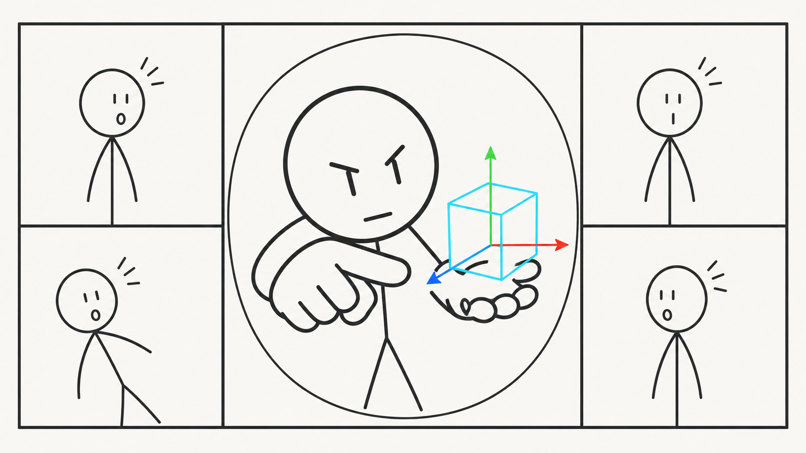

<div align="center">



# cam3

**Drop a GLB on your webcam. Zoom and Meet see it on OBS Virtual Camera.**

[](https://www.python.org/downloads/)
[]()
[](LICENSE)

[Quick start](#install) · [How it works](#how-it-works) · [Models](#models)

</div>

---

cam3 is a small Windows tray app. It reads your webcam, renders a `.glb` / `.gltf` on top with [pyrender](https://github.com/mmatl/pyrender), and sends the result to **OBS Virtual Camera**. No browser extension. No Unity or Blender running in the background.

The meeting feed stays clean. Nothing is drawn on the video except your model.

> **Demo tip:** Record a 10s clip (tray → load model → drag the screen pad → rotate in Meet). GIF in the README beats a wall of text.

---

## How it works

```
Webcam  →  OpenCV  →  pyrender overlay  →  pyvirtualcam  →  OBS Virtual Camera  →  Meet / Zoom / Teams
```

You control placement from a separate panel: a **screen pad** (drag the dot) plus sliders for depth, rotation, and scale. The panel does not embed a second camera preview, so it stays light.

---

## What you need

- Windows 10/11, Python 3.10+, a webcam
- [OBS Studio](https://obsproject.com/) 28+ (built-in virtual camera)

**OBS once:** install OBS → **Start Virtual Camera** → **Stop Virtual Camera** → close OBS. In your meeting app, choose **OBS Virtual Camera**.

If OBS mirrors your camera, the screen pad mirrors too (drag-left = left on the feed).

---

## Install

```bash
git clone https://github.com/aadi-joshi/cam3.git
cd cam3
python -m venv .venv
.\.venv\Scripts\Activate.ps1
pip install -r requirements.txt
python main.py
```

Tray icon appears. **Left-click** opens transform controls.

Optional: load a model at startup:

```bash
python main.py --model path\to\model.glb
```

---

## Tray

| Action | What it does |
|--------|----------------|
| **Transform controls** | Move / rotate / scale panel |
| **Wireframe cube** | Default cyan box at startup |
| **Load model** | Pick `.glb` / `.gltf` from `models/` or repo root |
| **None** | Webcam only |
| **Lock model** | Freeze transform |
| **Reset position** | Center and default rotation/scale |
| **Exit** | Quit |

---

## Transform panel

| Tab | Controls |
|-----|----------|
| **Move** | Screen pad + depth slider (near/far along the camera) |
| **Rotate** | Tilt X, Turn Y, Roll Z |
| **Scale** | Size |

---

## Models

Put files in [`models/`](models/), then tray → **Load model → Refresh list**.

Multi-part GLBs are merged with scene transforms applied, so rigs and props stay in one piece. Use models you have the right to use.

---

## Project layout

```
cam3/
├── main.py
├── camera_streamer.py
├── renderer.py
├── controls_window.py
├── screen_pad.py
├── drag_controls.py
├── model_catalog.py
├── models/
└── requirements.txt
```

---

## Contributing

Issues and PRs welcome. See [CONTRIBUTING.md](CONTRIBUTING.md). Keep changes small and focused.

---

## License

[MIT](LICENSE) © [Aadi Joshi](https://github.com/aadi-joshi)
